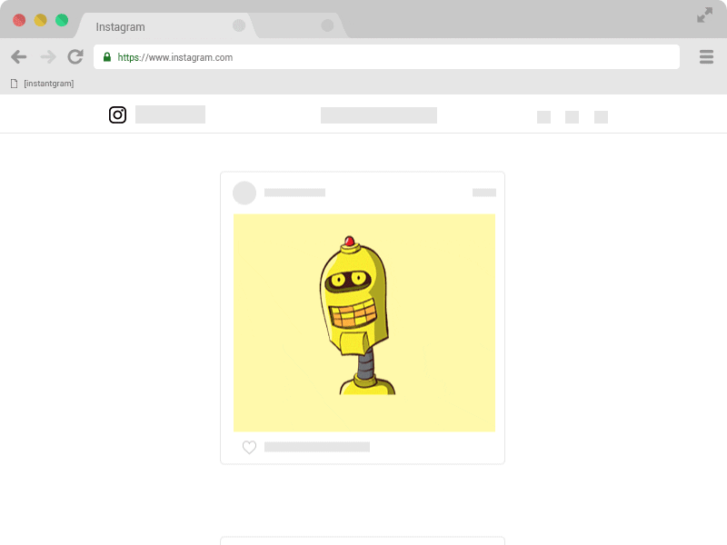

# [instantgram] v5.1.1

[Versão em Português =)](http://theus.github.io/instantgram/lang/pt-br)

[instantgram] is a bookmarklet with the purpose of downloading Instagram images. It is tiny, simple, and doesn't require extensions or downloads. Just access [this link][1] and drag the [instantgram] button to the bookmark bar of your browser, navigate to instagram.com (web), open an Instagram post (photo) and click on the bookmarklet. That's all it takes!

### [:arrow_right: Bookmarklet][1]

:bulb: Now in version 4.0.0, [instantgram] now working again with full support of all media types also recognizes canvas images.\
Also it has now support for multiple images videos in any site feed or post with modal.

## Compatibility

| Browser               | Compatible?        |
| --------------------- | ------------------ |
| Google Chrome         | :white_check_mark: |
| Mozilla Firefox\*\*   | :warning:          |
| Internet Explorer 11  | :white_check_mark: |
| Edge on chromium >=80 | :white_check_mark: |
| Edge\*                | :warning:          |

\*_apparently Edge doesn't allow you to drag a button to the bookmark bar_
\*\*_apparently Firefox don't allow drag a bookmarklet (link with `javascript:)` to bookmarkbar_

## Roadmap

- ~~a way of notify updates in [instantgram]~~ :heavy_check_mark: in v2.0.0
- ~~make a gif explaining the [instantgram]~~ :heavy_check_mark:
- ~~video :smirk_cat:~~ :heavy_check_mark: in v2.2.0

## Contributing

Read [CONTRIBUTING.md](CONTRIBUTING.md) for more information. :heart:

## Changelog

Read [CHANGELOG.md](CHANGELOG.md). 📰

[1]: http://theus.github.io/instantgram
